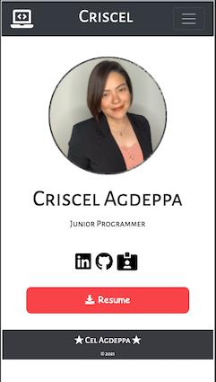
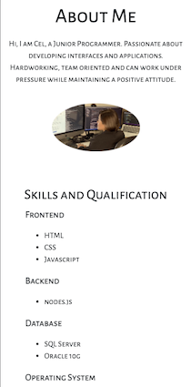
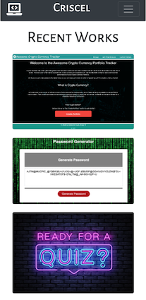
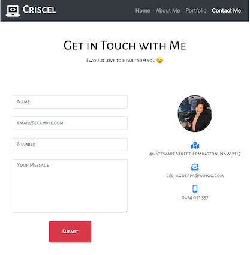

# MyPortfolio
This page highlight all my skills plus everthing that we have learned from the bootcamp so far. I tried to follow all the comments from all the previous homeworks, from naming conventions to coding styles.

This webpage consists of 4 responsive menus and pages. Link to my professional social accounts such as LinkedIn and Github can be found in my Home page. Updated CV can also be downloaded from here. About me is showcasing my Skills and Qualification with a bit of description on what is to be expected from me. Porfolio page is where the links from my recent projects are found. Lastly, Contact Me page is where you can find my personal details and also user will be able to send me a personal message via the webpage.

I created a new repository and layout for this assignment because the first portfolio that I created was not created in seperate repository. Also, the old page was not fully updated and functional.

## Installation
To be able to complete this webpage, I created 4 .HTML files and 4.CSS files. I implimented the "Mobile First" way of designing before going to desktop sizes.

I decided to have different .CSS file for every HTML structure so it will be easier to tract down errors to if ever there would be changes with the margins or paddings.

I also used an API for the submit button in Contact Me page.

## Usage
[My Portfolio - Responsive](https://criscel.github.io/MyPortfolio/index.html)

## Credits
[MDN Javascript](https://developer.mozilla.org/en-US/docs/Web/JavaScript),
[W3Scools](https://www.w3schools.com/js/default.asp)
[Form Spree](https://formspree.io/)

### Jekyll Themes

This Page uses the layout and styles from the Jekyll that I have selected [Thanks Github! :)]